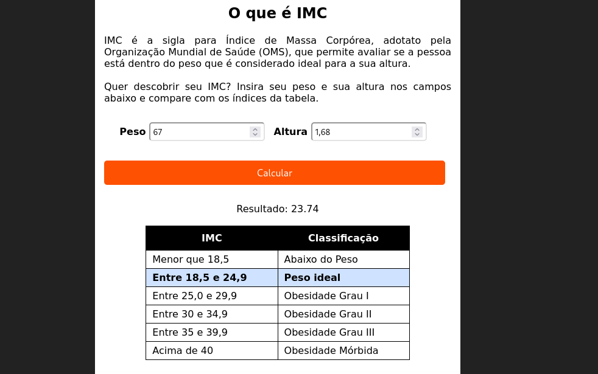

  <h1>Calculadora de IMC</h1>
    
    
    
     
     
     

Este projeto é uma calculadora de IMC (Índice de Massa Corporal) que ajuda a determinar o peso ideal de uma pessoa e exibe a classificação de peso em uma tabela, indicando onde você se encontra. Basta inserir seu peso e altura, e o sistema informará se você está abaixo do peso, no peso ideal, acima do peso ou em outra categoria, com base nas diretrizes de classificação do IMC.

  
Desenvolvido por <a target="_blank" rel="external" href="https://github.com/MegMinnie/"><strong>Mirele Oliveira da Silva</strong></a>

 

 

  
  ## Como Acessar a Aplicação

Acesse a aplicação por meio do link: <a href="https://megminnie.github.io/Calculadora-de-IMC/
"_blank">clique aqui</a>

## Screenshots

